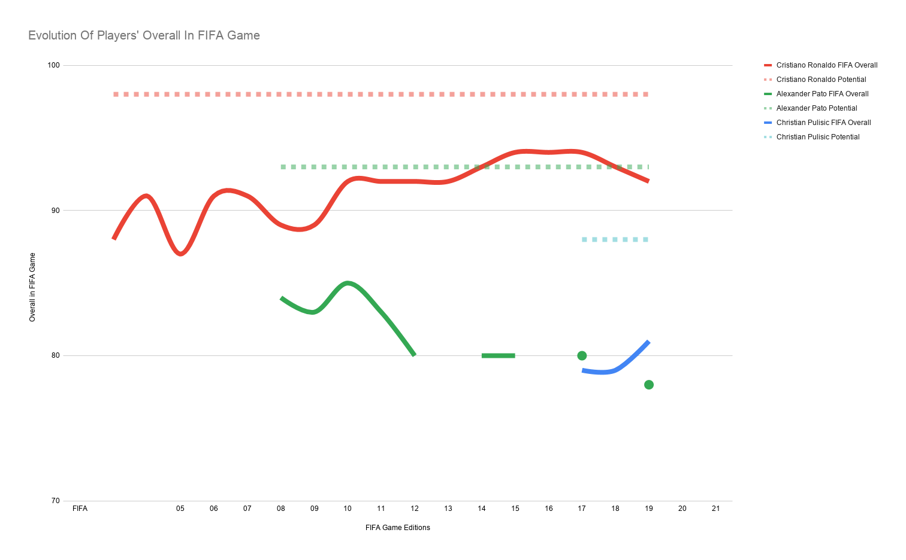

# How Accurate Is FIFA At Predicting Future Stars?

[-blue)](https://www.tu-dortmund.de/)
[-brightgreen)](https://github.com/AminAlAit/fifaaccuracy/blob/main/How%20Accurate%20Is%20FIFA%20At%20Predicting%20Future%20Stars.pdf)
[](https://kurt.digital/2022/05/11/footballs-future-stars-how-accurately-is-ea-fifa-predicting-them/)
[](https://www.r-project.org/)
[](./Dockerfile)

An empirical data investigation into whether EA Sports FIFA's potential ratings accurately predict the real-world career peaks of teenage football prospects.

This repository contains the full dataset, statistical analysis, visualization scripts, and documentation originally developed for the **Seminar in Sports Data Visualization** at **TU Dortmund University** (Summer Semester 2021), where it was awarded the top grade of **1.0 (1/1)**.

---

## Publications & Reports

- **Published Magazine Feature:** [Football's Future Stars: How Accurately is EA FIFA Predicting Them?](https://kurt.digital/2022/05/11/footballs-future-stars-how-accurately-is-ea-fifa-predicting-them/) (KURT Digital, TU Dortmund, May 11, 2022).
- **Complete Seminar Report:** [How Accurate Is FIFA At Predicting Future Stars.pdf](https://github.com/AminAlAit/fifaaccuracy/blob/main/How%20Accurate%20Is%20FIFA%20At%20Predicting%20Future%20Stars.pdf) (22-page research report, also archived in the [Portfolio](https://github.com/AminAlAit/Portfolio) repository).

---

## Research Question & Methodology

Every year, EA Sports assigns each young player two key numbers: their current **Overall (OVA)** and their projected **Potential (POT)** ceiling. This study asks a straightforward empirical question: **How often do teenage wonderkids actually reach or exceed that predicted ceiling?**

### Sampling Design
- **Cohort age:** Players observed at age exactly 19.
- **Selection criteria:** The top 360 players ranked by potential in each release.
- **Coverage:** 15 FIFA editions from FIFA 07 through FIFA 21 (released between 2006 and 2020).
- **Scope:** 5,400 player-year sampling points resulting in 5,391 distinct players and 43,198 career rows tracked across their careers up to age 33.
- **Data sources:** Scraped from SoFIFA with career and match statistics cross-referenced from Transfermarkt.

---

## Key Findings

1. **Low Hit Rate for Elite Talents:** For players in the highest potential bracket [84, 94], EA's forecast materialized only **8.8%** of the time for players with 10+ year careers, **13.6%** at 8+ years, and **11.8%** at 6+ years.
2. **The Top 1 Phenomenon:** Evaluating whether the single highest-rated 19-year-old in each release met expectations revealed mixed fates: genuine generational icons (Lionel Messi, Neymar) fulfilled their rating, while others struggled under physical or tactical barriers.
3. **Career Trajectory Distribution:** The analysis maps the full distribution of career outcomes, identifying the top 25 career surges (players who vastly outperformed expectations) alongside the steepest declines.

---

## Visualizations

### Overall Evolution of FIFA 05 Wonderkids


### Case Study: Cristiano Ronaldo


### Comparing Player Paths


---

## Repository Structure

```text
fifaaccuracy/
├── data/
│   ├── fifatable.csv          # Primary dataset (43,198 rows, FIFA 07 to FIFA 21)
│   ├── tm_stats.csv           # Transfermarkt match and appearance statistics
│   └── tm_trophies.csv        # Transfermarkt club and individual honors
├── scripts/
│   ├── manipulation-viz-script.R # Complete data cleaning, metrics, and ggplot2 figures
│   ├── notebook.Rmd           # R Markdown research notebook
│   └── scraping.R             # Historical scraping pipeline (SoFIFA & Transfermarkt)
├── docs/
│   ├── Methods & Data.pdf     # Detailed methodology and data collection notes
│   ├── Player Profiles.pdf    # Deep dive into individual player case studies
│   ├── plots.pdf              # Comprehensive collection of exported visualizations
│   ├── sem-sportdaten.pdf     # Seminar assignment brief (TU Dortmund)
│   ├── Visualizing Sports Data - 2021 - en.pdf # Seminar framework documentation
│   └── slides/                # Seminar presentation slide decks
│       ├── Part-1-Fifa-Preds.pptx
│       └── Part-2-Fifa-Preds.pptx
├── images/
│   ├── cover.jpeg             # Project cover graphic
│   ├── 3players.png           # Comparative trajectory plot
│   ├── Cristiano Ronaldo.png  # Player progression chart
│   └── Overall Evolution of FIFA 05 Wonderkids.png
├── How Accurate Is FIFA At Predicting Future Stars.pdf # Full 22-page research report
├── Dockerfile                 # Reproducible container configuration
├── docker-compose.yml         # Container orchestration with resource caps
└── README.md
```

---

## Data Dictionary (`fifatable.csv`)

| Column | Type | Description |
|---|---|---|
| `id` | Integer | Row identifier |
| `FifaIndex` | Integer | FIFA edition number (7 = FIFA 07, ..., 21 = FIFA 21) |
| `Fifa_year` | Integer | Release year index |
| `player_id` | Integer | Internal player identifier |
| `sofifa_page` | Integer | SoFIFA page index from sampling |
| `pos_in_list` | Integer | Position within the sorted potential list (1 to 360) |
| `SoFifaID` | Integer | Unique SoFIFA player ID |
| `SoFifaName` | String | SoFIFA URL slug name |
| `long_name` | String | Full legal player name |
| `short_name` | String | Common football name (e.g., L. Messi) |
| `age` | Integer | Player age at recording (19 to 33) |
| `nationality` | String | Player nationality |
| `club` | String | Club team at the time of recording |
| `position` | String | Primary playing position |
| `overall` | Integer | Current overall rating (OVA) |
| `max_potential` | Integer | Projected potential rating (POT) at age 19 |
| `games_played` | Integer | Total club appearances (Transfermarkt) |
| `points_per_game` | Numeric | Average points per game |
| `goals` | Integer | Total goals scored |
| `assists` | Integer | Total assists recorded |
| `minutes` | Integer | Total minutes played |

---

## Running with Docker

To run the analysis without installing R or external dependencies locally:

### Option 1: Run the Complete Analysis Script

```bash
docker compose run --rm analysis
```

### Option 2: Interactive RStudio Server

Launch an interactive RStudio instance in your browser:

```bash
docker compose up -d rstudio
```

Then open `http://localhost:8787` in your browser.
- **Username:** `rstudio`
- **Password:** `fifa`

The repository is mounted inside `/home/rstudio/fifaaccuracy`. You can open `scripts/manipulation-viz-script.R` or `scripts/notebook.Rmd` and run the code interactively.

To stop the container:
```bash
docker compose down
```

---

## Local Environment Requirements (Without Docker)

If running directly in a local R environment:
- R version 4.0 or higher
- Core packages: `tidyverse`, `ggplot2`, `readr`, `dplyr`, `scales`, `cowplot`, `gridExtra`, `hrbrthemes`, `viridis`, `ggridges`, `gghighlight`, `directlabels`, `ggrepel`, `rworldmap`, `wordcloud`
- Optional packages for extended figures: `ggflags` (`remotes::install_github("rensa/ggflags")`), `gganimate`, `gifski`

---

## Citation & Author

**Amin Al-Ait**  
Sports Data Visualization Seminar, TU Dortmund University (Grade: 1.0)  
Email: [AminAlAit@outlook.com](mailto:AminAlAit@outlook.com)  
Website: [aminalait.com](https://aminalait.com)  
Report: [How Accurate Is FIFA At Predicting Future Stars? (PDF)](https://github.com/AminAlAit/fifaaccuracy/blob/main/How%20Accurate%20Is%20FIFA%20At%20Predicting%20Future%20Stars.pdf)